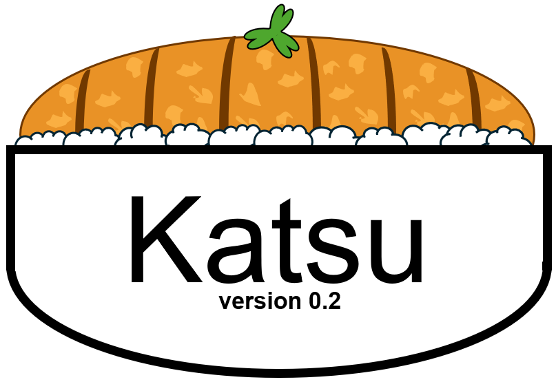

# Katsu: Integrated polarimetry and polarization simulation
[](https://codecov.io/gh/Jashcraf/katsu)
[](https://katsu.readthedocs.io/en/latest/?badge=latest)
[](https://joss.theoj.org/papers/82536dc5307fe34ddd929c89ed3d2575)



Katsu is a Python 3.8+ library that contains an integrated library for modeling simple polarization effects (represented with Mueller calculus), simulating full stokes and mueller polarimetry, and integrating both of these as data reduction tools for conducting polarimetry in the laboratory. We also feature motion control routines for commercially available rotation stages for a more Pythonic interface to devices that would otherwise require serial communication. 

## Documentation
The documentation can be found at [katsu.readthedocs.io](https://katsu.readthedocs.io/en/latest). 

## Optional dependencies

Katsu has limited support for numpy-like backends, like `cupy` for accelerated computing and `jax` for automatic differentiation. These are not strict requirements, and must be installed by the user. To switch to them at runtime, either the `set_backend_to_cupy` or `set_backend_to_jax` method can be used from `katsu.math` at runtime.

## Features

- Mueller calculus
- Mueller data reduction
- Mueller polarimetry routines
- Motion control for the Agilis piezoelectric rotation stages

## Installation
Katsu can be installed using `pip`, just run the following in your terminal
```
pip install katsu
```

Alternatively, Katsu is installable from source. Simply run the following in your terminal
```
git clone https://github.com/Jashcraf/katsu/
cd katsu
pip install .
```

## Contributions / Questions
If you wish to contribute to Katsu, or have any questions about its use, please open an issue to start a discussion. Before a pull request is made, we prefer that an issue is made to discuss the contributions at a high level. 

## Acknowledgements
Thanks to Quinn Jarecki of UA's Polarization Lab for the starting theory on dual rotating retarder mueller polarimetry, and for overall helpful discussions. Thanks also to William Melby, Manxuan Zhang, and Max Millar-Blanchaer for being the first to test out the Mueller data reduction code.
